# Wazuh SIEM with VirusTotal Threat Intelligence Integration

## Overview

This project demonstrates the deployment of Wazuh SIEM on Ubuntu Server 22.04.5 LTS, the enrollment of a Windows endpoint as a Wazuh Agent, and the integration of VirusTotal Threat Intelligence for file reputation analysis.

## Objectives

- Install Wazuh on Ubuntu Server
- Connect a Windows endpoint
- Configure VirusTotal API integration
- Verify threat intelligence alerts


## Step 1: Download Wazuh Installation Script

Downloaded the official Wazuh installation script from the Wazuh package repository to begin the deployment process.

```bash
curl -sO https://packages.wazuh.com/4.12/wazuh-install.sh
```

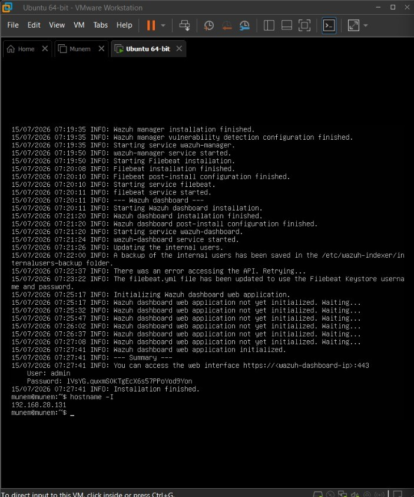

## Step 2: Accessing the Wazuh Dashboard
Successfully opened the Wazuh Dashboard through the web browser after completing the installation.


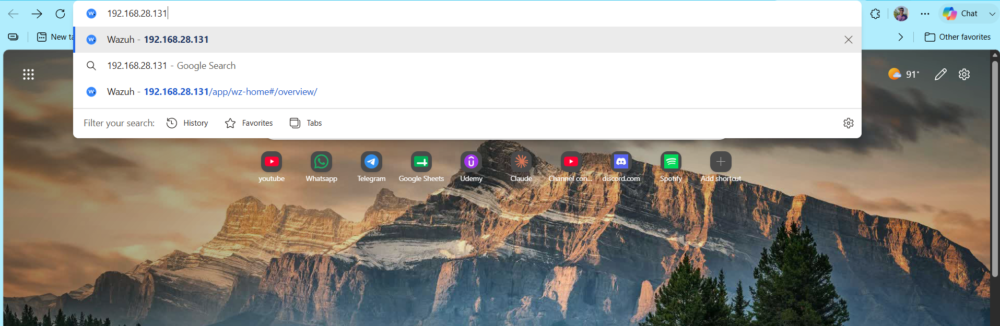

## Step 3: Wazuh Dashboard Overview

Verified that the Wazuh Dashboard is running correctly and ready for endpoint enrollment.


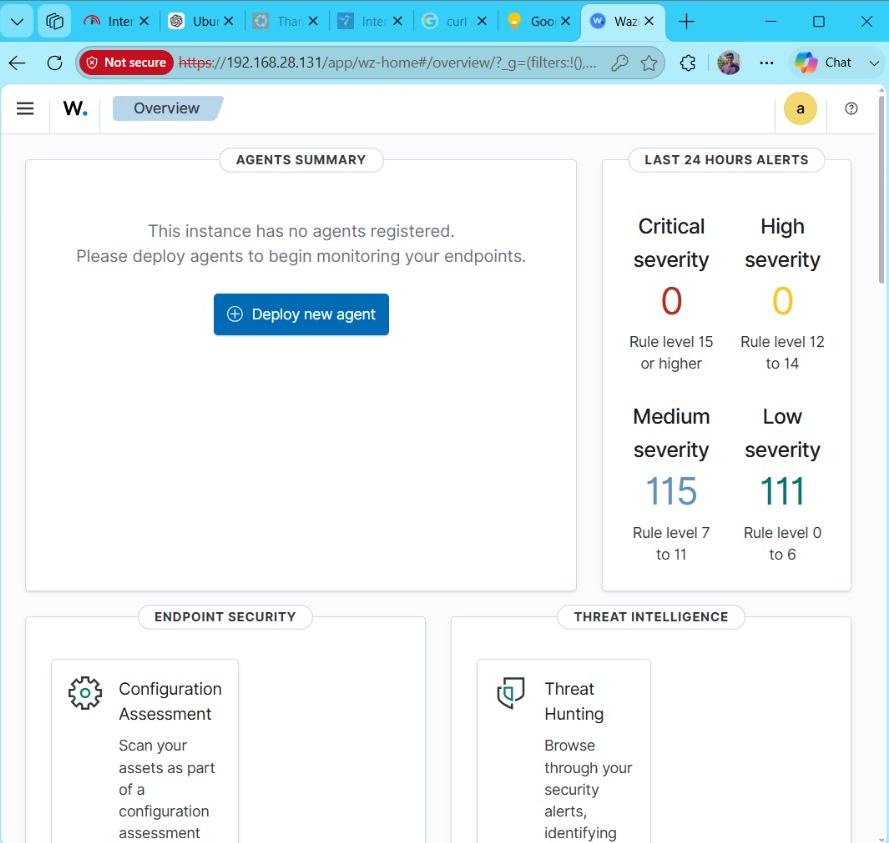

## Step 4: Installing Wazuh Agent on Windows

Installed the Wazuh Windows Agent and configured it to communicate with the Wazuh Manager.

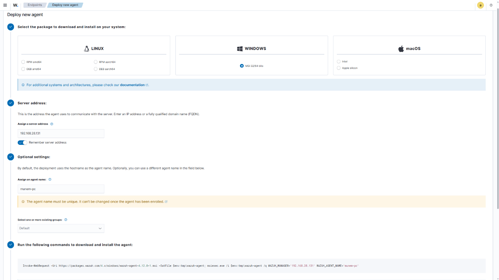

## Step 5: Verifying Registered Agent

Verified that the Windows endpoint was successfully enrolled and appeared as an Active Agent in the Wazuh Dashboard.

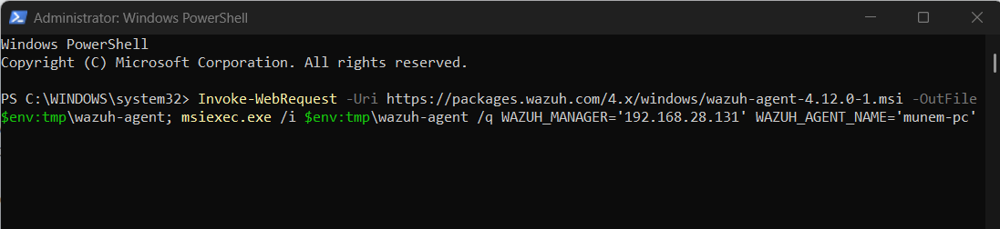

## Step 6: Agent Management Dashboard

Confirmed that the connected endpoint is actively sending logs to the Wazuh Manager.

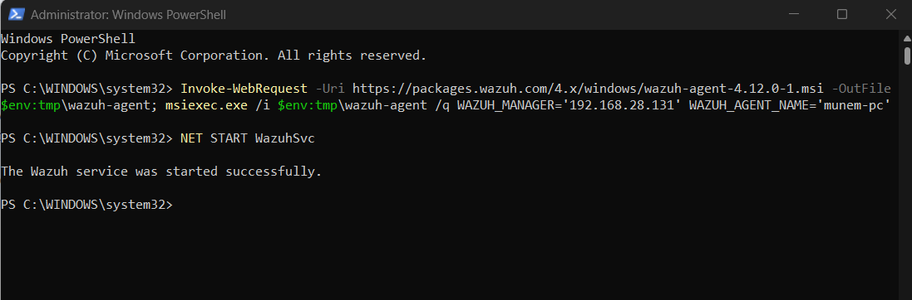

## Step 7: VirusTotal Integration Settings

Configured the VirusTotal API integration inside the Wazuh Manager by editing the manager configuration file.

```powershell
<integration>
  <name>virustotal</name>
  <api_key>YOUR_API_KEY</api_key>
  <group>syscheck</group>
  <alert_format>json</alert_format>
</integration>
```

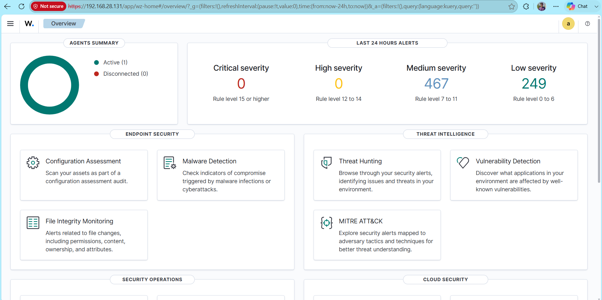

## Step 8: Restarting Wazuh Manager

Restarted the Wazuh Manager service after updating the VirusTotal integration settings.

```bash
sudo systemctl restart wazuh-manager
```

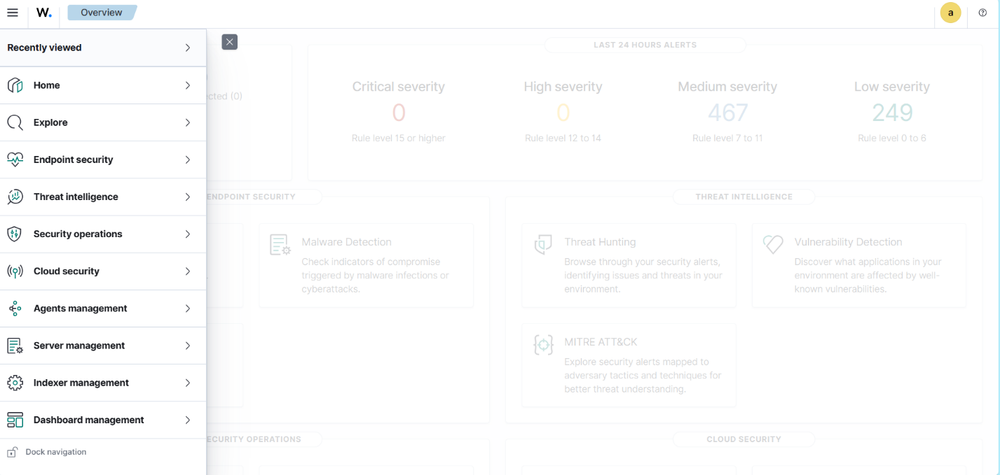

## Step 9: Verifying Wazuh Service Status

Checked whether the Wazuh Manager service was running successfully after applying the new configuration.

```text
sudo systemctl status wazuh-manager
```

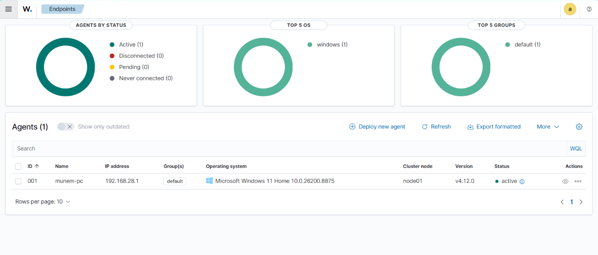

## Step 10: signin to VirusTotal

go to www.virustotal.com and login

```bash
sudo grep -i virustotal /var/ossec/etc/ossec.conf
```

```bash
sudo tail -30 /var/ossec/etc/ossec.conf
```


## Step 11: collect Api Key form virustotal.com/gui/user/shahriarmunem/apikey

copy the API Key


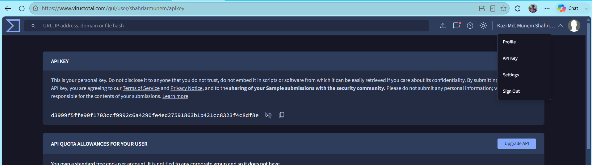

## Step 12: collect Api Key form virustotal.com/gui/user/shahriarmunem/apikey

copy the API Key


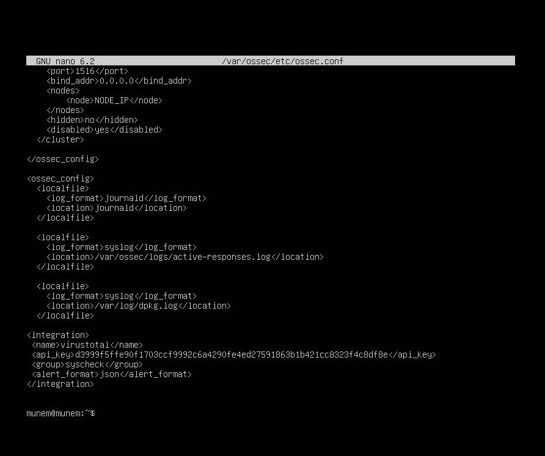

## Step 13: connect the api
connect the api by adding bellow text 

```XML
<integration>
  <name>virustotal</name>
  <api_key>YOUR_API_KEY</api_key>
  <group>syscheck</group>
  <alert_format>json</alert_format>
</integration>
```

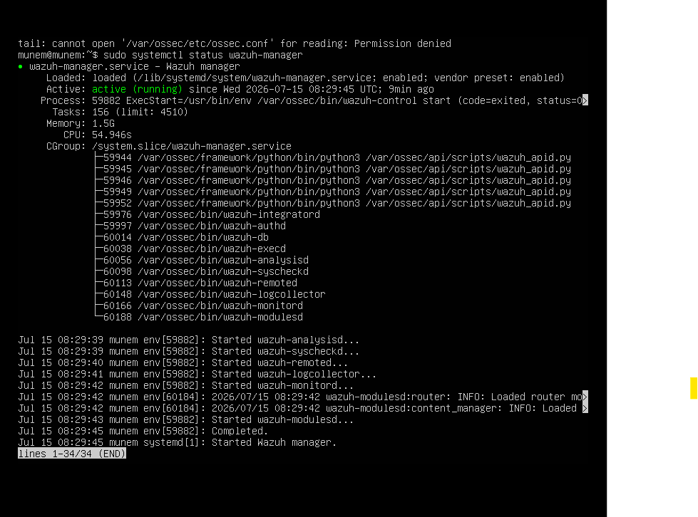

## Step 14: Generate a Test Event

Create a text file inside a monitored directory on the Windows endpoint. Wazuh detects the new file, calculates its hash, and sends it to VirusTotal for reputation analysis.

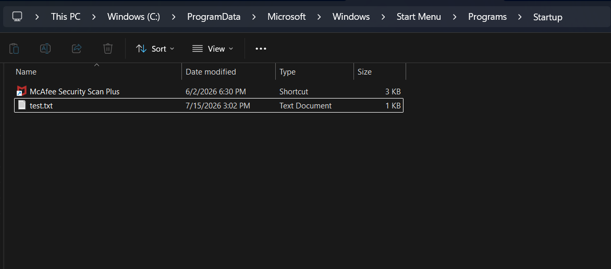

## Step 15: Verify the VirusTotal Alert

Open the Discover page in the Wazuh Dashboard and search using the following query:

```text
rule.groups:virustotal
```

The dashboard displays the VirusTotal response. Since the test file is newly created, VirusTotal reports **"No records in VirusTotal database,"** confirming that the integration is working correctly.

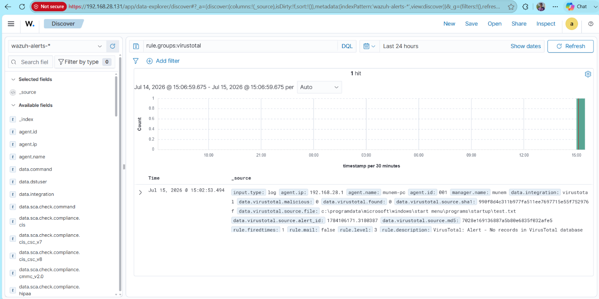

